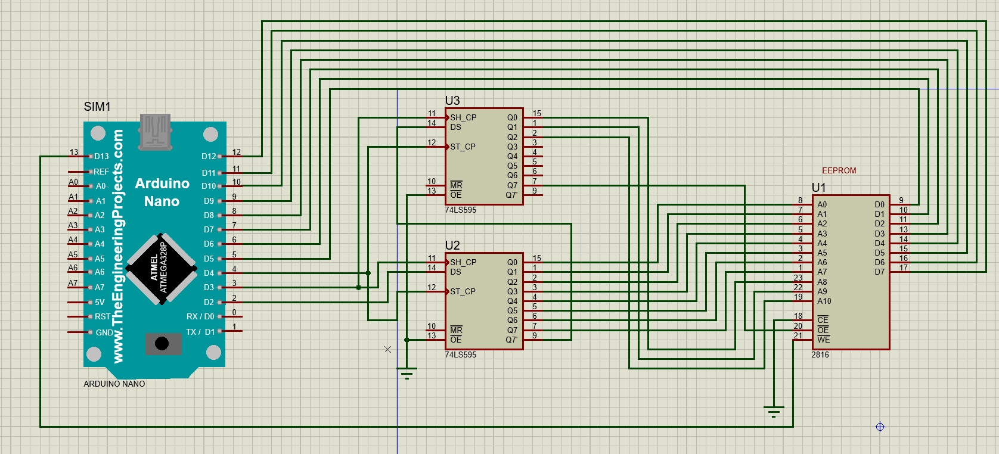

# EEPROM-Programmer
## introduction:
The first thing we need to think about when we program an EEPROM with a microcontroller is how much pins we need and how much  is available in the microcontroller. Here we used `AT28C16` EEPROM which has (2k x 8 = 16k) 8k locations with 8-bit wide.
 It has 11 pin for Addresses A0 to A12, 8 pins for data and some other pins to control the chip like chip Enable `CE`
 , Output Enable `OE` and Write Enable `WE`. Sum of all needed pins to be controlled with microcontroller = 22  pin. Using a microcontroller with this specs is wasting of resources. I will use `74CH595` 8-bit Shift Registers to reduce the number of pins we will use form the microcontroller. In this case you can use 3 Shift Register, but I will use just 2.
 ## Schematic:
 

To cover all 11 pins of the addresses, I used 2 cascaded 8-bit Shift Register. data sent form microcontroller to the first 8-bit wide Shift Register in series through Data Serial pin `DS`. The last bit in the Shift Register is connected to Data Serial of the second Shift Register. so the wide of data I can store in the 2 Shift Registers is (8+8) 16-bit. I only need 11 and 1 for Output Enable. Data pins in the EEPROMM is connected directly to the microcontroller from pin 5 to pin 12  . Write Enable is connected to pin 13, Data serial pin is connected to pin 2, `SH-CP` shift register clock input is connected to pin 3 and it is common through the 2 Shift Register. `ST-CP` Storage register clock input is connected to pin 4 and it is common too.

## Shift Register :
As mentioned in 74HC595 data sheet, the chip has 2 registers: 8-bit Stage register and Storage register. Data is shifted on the LOW-TO-HIGH transition of the SHCP input. The data in the shift register is transferred to the storage register on a LOW-TO-HIGH transition of the STCP input. Data in the Storage register appears at the output whenever the output enable input is LOW.

## Code:
Defining pins used :
```
#define SHIFT_DATA 2
#define SHIFT_CLK 3
#define SHIFT_LATCH 4
#define EEPROM_D0 5
#define EEPROM_D7 12
#define WRITE_EN 13
```
#### Set-Value Function:
```
void Set_value(int value, bool outputEnable);
```
A function takes value and output enable mode and sets a value to the shift registers and transfer it to the parallel-out storage register. To send 16-bit value in serial we need to send the last 8-bit first then the second 8-bit. we need to remember that I use the last pin in the second shift register for the output enable mode of the EEPROM. To get the first 8-bit to be shifted is to shift the wanted address 8 times to the right and ORing it with the output enable mode we want.
##### Example
we want to get `1111 1111 111 `address. we shift the address 8 times to the right
```
address = address >> 8;
//address becomes 0000 0000 111

//adding the output enable mode to the last bit
address |= (outputEnable ? 0x00 : 0x80);

 0000 0000 111
|1000 0000 000
=1000 0000 111

if ouputEnable is False (EEPROM set in input mode) = 0x80
```
After getting the first 8 bit ready to be shifted we will use the Arduino library `shiftOut`.
you can see details about it here
[ShiftOut](https://www.arduino.cc/reference/en/language/functions/advanced-io/shiftout/).
finally we shift the first 8-bit which is the address without any shifting, then we send a LOW-TO-HIGH pulse to SC-TP input pin.
###### complete Function:
```
void Set_value(int value, bool outputEnable)
{
  shiftOut(SHIFT_DATA, SHIFT_CLK, MSBFIRST, (value>>8)| (outputEnable ? 0x00 : 0x80));
  shiftOut(SHIFT_DATA, SHIFT_CLK, MSBFIRST, value);

  digitalWrite(SHIFT_LATCH, LOW);
  digitalWrite(SHIFT_LATCH, HIGH);
  digitalWrite(SHIFT_LATCH, LOW);
}
```
#### Read EEPROM Function:
A function takes an address and return the value in that address.
```
byte readEEPROM_byte(int Address)
{
  //setting data pins as input
  for(int pin = EEPROM_D0 ; pin <= EEPROM_D7; pin++)
  {
    pinMode(pin, INPUT);
  }

  // getting value on the data pins
  Set_value(Address, true /*EEPROM IN READ MODE*/);

  //storing data
  byte data = 0 ;
  for(int pin = EEPROM_D7 ; pin >= EEPROM_D0 ; pin--)
  {
    data = (data << 1) + digitalRead(pin);
     return data;
  }
}
```
Note that the one in `(data << 1)` is shifted to be out of the 8-bit after the FOR loop is finished.
#### Write EEPROM Function:
A function takes an address and a value and write the value into that address.
```
void writeEEPROM(int address, int data0)
{
  //setting arduino pins as output
  for(int pin = EEPROM_D0 ; pin <= EEPROM_D7; pin++)
  {
    pinMode(pin, OUTPUT);
  }

  Set_Adress(address, false /*write mode*/);

  for (int pin = EEPROM_D0 ; pin <= EEPROM_D7 ; pin++)
  {
    digitalWrite(pin, data0 & 1);
    data0 = data0 << 1 ;
  }

  digitalWrite(WRITE_EN, LOW);
  delayMicroseconds(1);
  digitalWrite(WRITE_EN, HIGH);
  delay(10); //to be tested
}
```
Note that the two lines
```
digitalWrite(pin, data & 1);
data = data << 1 ;
```
In the first itration we want to write D0 only, So by ANDing with 1
we get the LSB only and write it to the pin, Then we shift the data to the left to get the second bit only and so on.
```
our value:  1111 1111
          & 0000 0001
          = 0000 0001
```
### Complete Code
```
#define SHIFT_DATA 2
#define SHIFT_CLK 3
#define SHIFT_LATCH 4
#define EEPROM_D0 5
#define EEPROM_D7 12
#define WRITE_EN 13

/*
 * Output the address bits and outputEnable signal using shift registers.
 */
void setAddress(int address, bool outputEnable) {
  shiftOut(SHIFT_DATA, SHIFT_CLK, MSBFIRST, (address >> 8) | (outputEnable ? 0x00 : 0x80));
  shiftOut(SHIFT_DATA, SHIFT_CLK, MSBFIRST, address);

  digitalWrite(SHIFT_LATCH, LOW);
  digitalWrite(SHIFT_LATCH, HIGH);
  digitalWrite(SHIFT_LATCH, LOW);
}


/*
 * Read a byte from the EEPROM at the specified address.
 */
byte readEEPROM(int address) {
  for (int pin = EEPROM_D0; pin <= EEPROM_D7; pin += 1) {
    pinMode(pin, INPUT);
  }
  setAddress(address, /*outputEnable*/ true);

  byte data = 0;
  for (int pin = EEPROM_D7; pin >= EEPROM_D0; pin -= 1) {
    data = (data << 1) + digitalRead(pin);
  }
  return data;
}


/*
 * Write a byte to the EEPROM at the specified address.
 */
void writeEEPROM(int address, byte data) {
  setAddress(address, /*outputEnable*/ false);
  for (int pin = EEPROM_D0; pin <= EEPROM_D7; pin += 1) {
    pinMode(pin, OUTPUT);
  }

  for (int pin = EEPROM_D0; pin <= EEPROM_D7; pin += 1) {
    digitalWrite(pin, data & 1);
    data = data >> 1;
  }
  digitalWrite(WRITE_EN, LOW);
  delayMicroseconds(1);
  digitalWrite(WRITE_EN, HIGH);
  delay(10);
}


/*
 * Read the contents of the EEPROM and print them to the serial monitor.
 */
void printContents() {
  for (int base = 0; base <= 255; base += 16) {
    byte data[16];
    for (int offset = 0; offset <= 15; offset += 1) {
      data[offset] = readEEPROM(base + offset);
    }

    char buf[80];
    sprintf(buf, "%03x:  %02x %02x %02x %02x %02x %02x %02x %02x   %02x %02x %02x %02x %02x %02x %02x %02x",
            base, data[0], data[1], data[2], data[3], data[4], data[5], data[6], data[7],
            data[8], data[9], data[10], data[11], data[12], data[13], data[14], data[15]);

    Serial.println(buf);
  }
}


// 4-bit hex decoder for common anode 7-segment display
byte data[] = { 0x81, 0xcf, 0x92, 0x86, 0xcc, 0xa4, 0xa0, 0x8f, 0x80, 0x84, 0x88, 0xe0, 0xb1, 0xc2, 0xb0, 0xb8 };

// 4-bit hex decoder for common cathode 7-segment display
// byte data[] = { 0x7e, 0x30, 0x6d, 0x79, 0x33, 0x5b, 0x5f, 0x70, 0x7f, 0x7b, 0x77, 0x1f, 0x4e, 0x3d, 0x4f, 0x47 };


void setup() {
  // put your setup code here, to run once:
  pinMode(SHIFT_DATA, OUTPUT);
  pinMode(SHIFT_CLK, OUTPUT);
  pinMode(SHIFT_LATCH, OUTPUT);
  digitalWrite(WRITE_EN, HIGH);
  pinMode(WRITE_EN, OUTPUT);
  Serial.begin(57600);

  // Erase entire EEPROM
  Serial.print("Erasing EEPROM");
  for (int address = 0; address <= 2047; address += 1) {
    writeEEPROM(address, 0xff);

    if (address % 64 == 0) {
      Serial.print(".");
    }
  }
  Serial.println(" done");


  // Program data bytes
  Serial.print("Programming EEPROM");
  for (int address = 0; address < sizeof(data); address += 1) {
    writeEEPROM(address, data[address]);

    if (address % 64 == 0) {
      Serial.print(".");
    }
  }
  Serial.println(" done");


  // Read and print out the contents of the EERPROM
  Serial.println("Reading EEPROM");
  printContents();
}


void loop() {
  // put your main code here, to run repeatedly:

}
```
